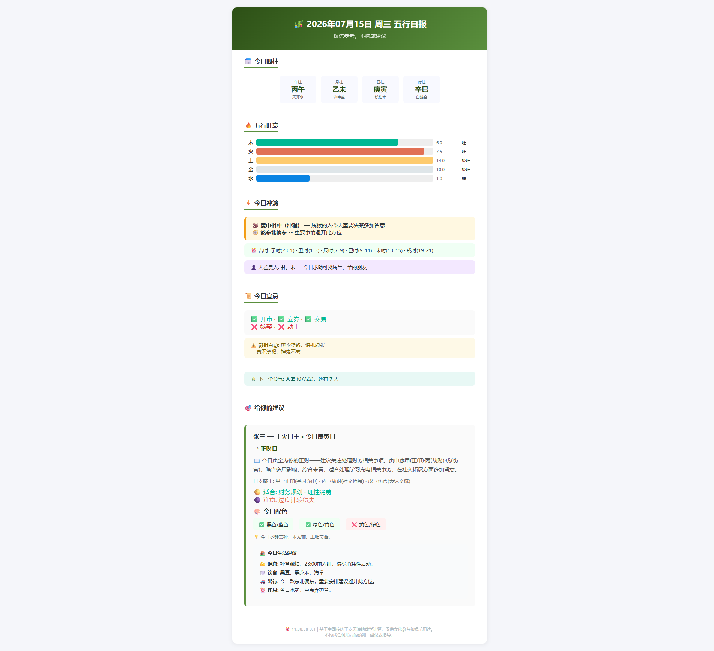

# 🎋 五行每日播报 (Wuxing Daily)


每天早上 7:00 自动推送个性化五行日报到你的邮箱。纯算法计算，零外部 API 依赖。



## 功能

- 📅 **每日干支** — 年柱/月柱/日柱 + 纳音
- 🔥 **五行旺衰** — 子平法四层计算（月令+透干+通根+合化刑冲）
- ⚡ **冲煞吉时** — 冲煞生肖/方位 + 黄道吉时
- 📜 **黄历宜忌** — 60甲子日静态宜忌数据
- 🎯 **个性化建议** — 日主x今日干支 → 十神分析+配色推荐
- 🌾 **节气长版** — 二十四节气日自动发长版（含义+五行转换+养生+饮食）
- 📊 **周报月报** — 周日回顾+预览，节气换月运程总览
- 👥 **多用户** — 支持全家每人独立定制
- 📲 **多渠道** — 邮件 + Server酱 + Telegram

## 🙋 不懂八字？先查日主

运行一行命令，输入你的阳历生日即可得到日主和生肖：

```bash
python find_day_master.py 1998-07-07 08:55 北京
# 输出: 日主: 乙木 | 生肖: 虎 | 年柱: 戊寅
# 输出: ━━━ 复制下面这段到 users.json ━━━
# 输出: {"name":"你的名字","day_master":"乙","zodiac":"虎","email":"你的邮箱"}
```

出生地可选——用于真太阳时校正（新疆等西部地区的时柱可能差一个时辰）。

## 快速开始

### 1. Fork 本仓库

### 2. 配置 GitHub Secrets

在 Settings → Secrets and variables → Actions 中添加：

| Secret | 说明 | 必填 |
|--------|------|------|
| `USERS` | 用户配置 JSON 数组 | ✅ |
| `EMAIL_SENDER` | 发件邮箱地址 | ✅ |
| `EMAIL_PASSWORD` | 邮箱 SMTP 密码/授权码 | ✅ |
| `EMAIL_SMTP` | SMTP 服务器（默认 smtp.qq.com） | |
| `EMAIL_PORT` | SMTP 端口（默认 587） | |
| `SERVERCHAN_SCKEY` | Server酱 key（可选） | |
| `TELEGRAM_BOT_TOKEN` | Telegram Bot token（可选） | |
| `TELEGRAM_CHAT_ID` | Telegram chat ID（可选） | |

### 3. USERS JSON 格式

```json
[
  {"name":"张三分","day_master":"丁","zodiac":"鼠","email":"user@qq.com"}
]
```

- `day_master`: 日主天干（甲~癸）。不知道日主的可以请懂八字的朋友帮看。
- `zodiac`: 生肖（鼠牛虎兔龙蛇马羊猴鸡狗猪）

### 4. 手动测试

在 Actions 页面点击 "Run workflow" → "Run workflow"。

## 技术说明

- **干支计算基准**: 1900-01-01 = 甲戌日
- **五行算法**: 子平法（四层：月令→透干→通根→合化刑冲），所有阈值参数化
- **黄历数据**: 《协纪辨方书》60甲子日宜忌静态表
- **节气数据**: 紫金山天文台发布的 2020-2030 年节气表
- **零外部 API**: 不需要网络请求即可生成全部内容

## 免责声明

本工具基于中国传统干支历法的数学计算，仅供文化参考和娱乐用途。不构成任何形式的预测、建议或指导。五行分析存在多种学派解读，本工具采用算法为其中一种。请理性看待，勿用于重大决策依据。

## License

MIT
